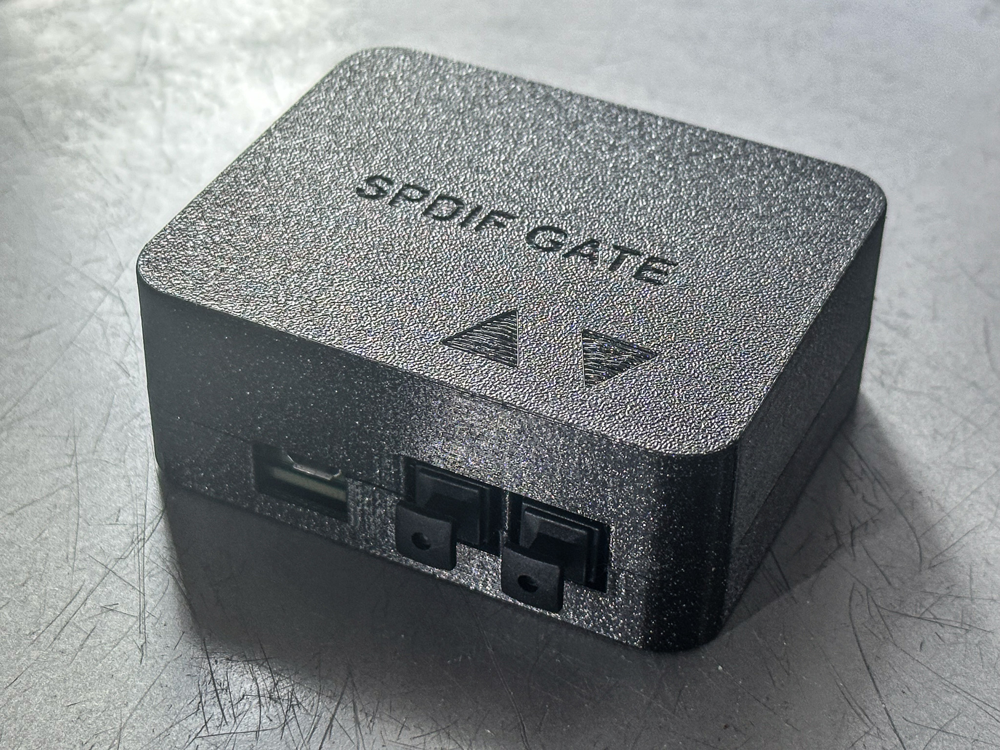

# SPDIF Gate

Forked from [Elehobica's wonderful work](https://github.com/elehobica/pico_spdif_rx) on decoding the S/PDIF protocol on the RP2040's
PIO state machine, I used it to make this small program. I did however break the fork link so that I would not create a PR on the
upstream repo by mistake.

All credit is due to Elehobica's work. Most of the files in this repository come from upstream, I simply added the "spdif_gate" application
in the samples folder.

This project started to solve a problem that was created by "Smart TVs" that don't go to sleep when you think they do. They keep humming 
in the background when the display is off, keeping a steady bit stream on their TOSLINK outputs. A family member uses a hairing aid and has 
the problem that a device he uses to convert the TV's optical audio into a bluetooth audio stream doesn't fully turn off when the TV is not 
in use, causing continuous audio cues as he moves around the house upon his hearing aid establishing link with the device near the TV.

I built a device with a custom PCB around a Raspberry Pi Pico, fitted with an optical receiver and transmitter with an AND gate in between 
(technically a quad NAND of which to gates are configured as an AND gate) so that the RP2040 can read the incoming S/PDIF signal and 
decide if real audio is transmitted or if it's just an empty stream with no audio, and turn the gate on and off accordingly 
(with a preset timeout of 3 minutes).

You can find some photos in the photos directory, the schematics and PCB files in the board directory and CAD models for the enclosure in the models directory.
